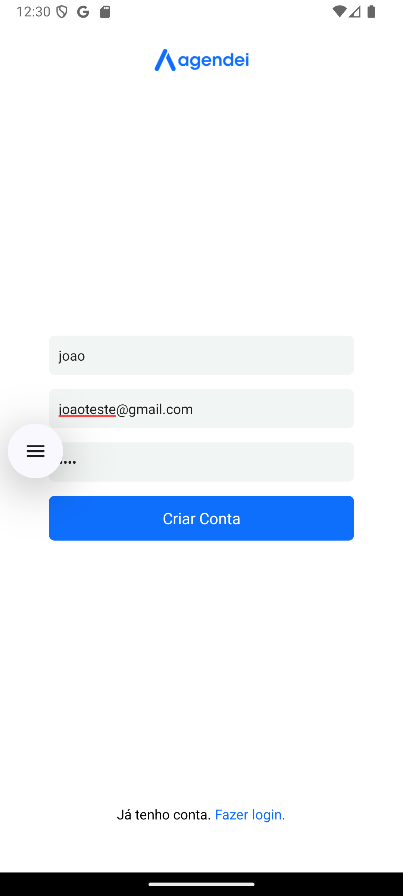
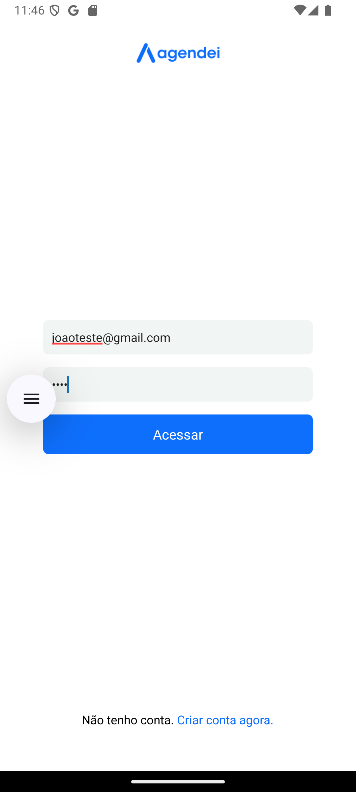
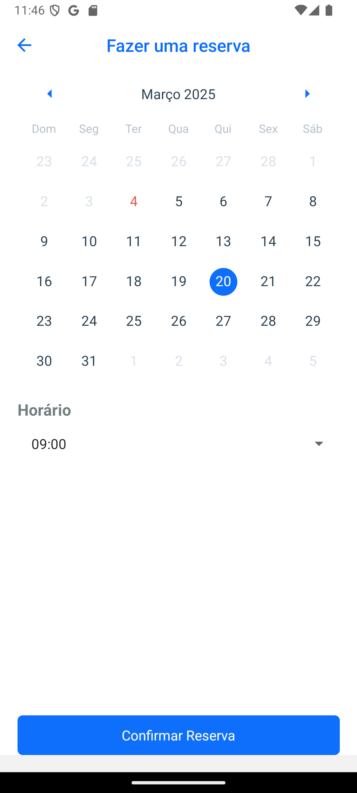
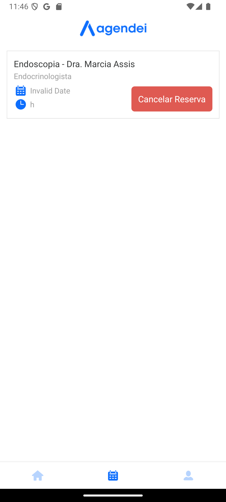

# 🏥 Agendei - Sistema de Agendamento Médico (Mobile) [](https://nodejs.org/) [](LICENSE)

### 🚀 Visão Geral

Sistema completo para agendamento de consultas médicas, composto por:

- 📱 **Aplicativo Mobile** (Pacientes)
- 🖥️ **Painel Admin** (Gestores)
- 🚀 **Backend** (API RESTful)

Este repositório contém o **Mobile** do sistema, que permite que os usuários se cadastrem, escolham médicos e marquem consultas..

## ✨ Características do Projeto

✅ Cadastro e Login de Usuários – Permite que os usuários se cadastrem e acessem o sistema.
<br>
✅ Agendamento de Consultas – Interface para marcar, editar e cancelar consultas.
<br>
✅ Visualização de Médicos – Lista de médicos disponíveis para agendamento.
<br>
✅ Calendário Integrado – Utilização de react-native-calendars para facilitar a escolha de datas.
<br>
✅ Navegação Intuitiva – Navegação entre telas com @react-navigation.
<br>
✅ Design Responsivo – Interface adaptada para diferentes tamanhos de tela.

## 🛠️ Tecnologias Utilizadas

### Mobile

- **React Native** – Framework para desenvolvimento de aplicativos móveis multiplataforma.
- **Expo** – Plataforma que facilita o desenvolvimento e a publicação de aplicativos React Native.
- **Axios** – Cliente HTTP para comunicação com o backend.
- **React Navigation** – Biblioteca para gerenciamento de navegação entre telas.
- **React Native Calendars** – Componente para exibição e seleção de datas.
- **React Native Picker** – Componente para seleção de opções em formulários.

## 🛠️ Ferramentas de Desenvolvimento

- **Expo CLI** – Ferramenta para desenvolvimento e build de aplicativos Expo.
- **Babel** – Transpilador para JavaScript moderno.

## Como Rodar o Projeto Localmente

### Pré-requisitos

- Node.js (versão 18 ou superior)
- npm ou yarn (gerenciadores de pacotes)

### Passos

1. Clone o repositório:
   ```bash
   git clone https://github.com/JPerrut/agendei-mobile.git
   ```
2. Acesse a pasta do projeto:
   ```bash
   cd agendei-mobile
   ```
3. Instale as dependências:
   ```bash
   npm install
   ```
4. Inicie o servidor de desenvolvimento:
   ```bash
   npx expo start
   ```

## 🖥️ Telas do Aplicativo

### Abaixo estão as principais telas disponíveis no aplicativo:

## Screenshots

<table>
  <tr>
    <td align="center">
      
      <br><em>Tela de Cadastro</em>
    </td>
    <td align="center">
      
      <br><em>Tela de Login</em>
    </td>
    <td align="center">
      
      <br><em>Tela de Consultas</em>
    </td>
  </tr>
  <tr>
    <td align="center">
      
      <br><em>Tela de Agendamento</em>
    </td>
    <td align="center">
      
      <br><em>Agendamento de Horário</em>
    </td>
    <td align="center">
      
      <br><em>Agendamento Concluído</em>
    </td>
  </tr>
  <tr>
    <td align="center">
      
      <br><em>Tela de Usuário</em>
    </td>
  </tr>
</table>

## Contribuição

### Contribuições são bem-vindas! Siga os passos abaixo:

1. Faça um fork do projeto.
2. Crie uma branch para sua feature (`git checkout -b feature/nova-feature`).
3. Commit suas mudanças (`git commit -m 'Adiciona nova feature'`).
4. Faça push para a branch (`git push origin feature/nova-feature`).
5. Abra um Pull Request.

## Licença

Este projeto está licenciado sob a <a href="https://opensource.org/license/mit">MIT License</a>.

## Contato

### Se tiver dúvidas ou sugestões, entre em contato:

Nome: João Perrut <br>
Email: joaoperrutc@gmail.com <br>
Linkedin: https://www.linkedin.com/in/perrut/
